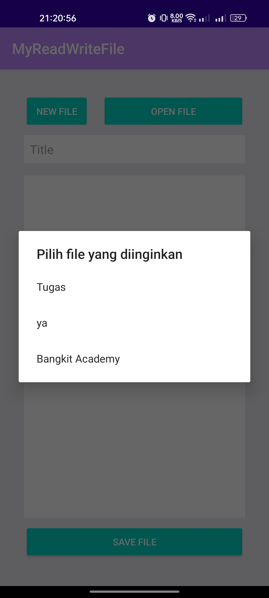
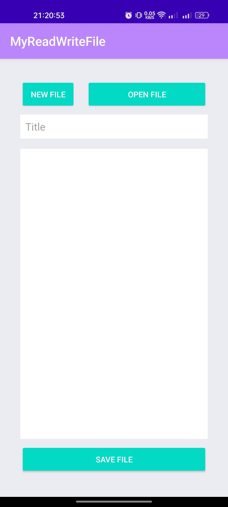

# SimpleNote
Belajar Fundamental Aplikasi Android (BFAA) Dicoding Academy | Bangkit Academy 2023 Mobile Development How to save and open files in storage 

#Project Screenshot :

<table>
    <tr>
        
        <td>
        <td>
    </tr>
</table>  
